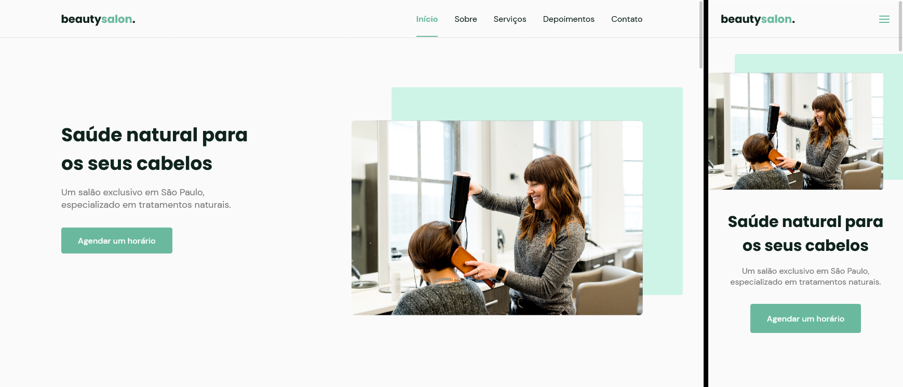

  <a href="#-projeto">Projeto</a>&nbsp;&nbsp;&nbsp;|&nbsp;&nbsp;&nbsp;
  <a href="#-tecnologias">Tecnologias</a>&nbsp;&nbsp;&nbsp;|&nbsp;&nbsp;&nbsp;
  <a href="#-layout">Layout</a>

  

 

  

## 💻 Projeto

Site no formato One Page, responsivo. Ótimo para pequenas e médias empresas.

## 🚀 Tecnologias:

- HTML
- CSS
- JavaScript

## 📚 Bibliotecas:

- [Google Fonts](https://fonts.google.com/)
- [SwipeJS](https://github.com/nolimits4web/Swiper)
- [ScrollRevel](https://scrollrevealjs.org)

## 🔧 Utilitários

- [randomuser.me](https://randomuser.me/photos)
- [IconMoon](https://icomoon.io/app/#/select)
- [Whatsapp](https://api.whatsapp.com/)

## 🔖 Layout

Você pode visualizar o layout do projeto através [deste link](https://www.figma.com/file/YJ21RnZoelU6tthwExzMVP/Origin-Six). É necessário ter conta no [Figma](https://figma.com) para acessá-lo.
